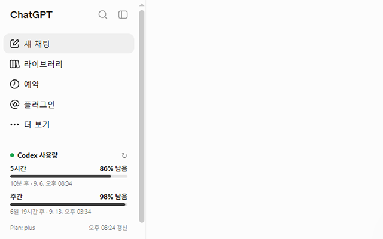
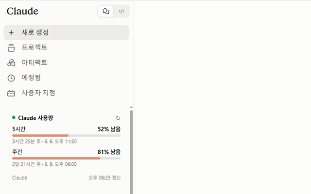

# Codex + Claude Usage Sidebar

<p align="center">
  
</p>

Monitor your Codex and Claude usage limits directly inside the left sidebar of their web applications with this Firefox extension.

## Overview

This extension displays the remaining usage quota for ChatGPT/Codex and Claude. It shows the current 5-hour and weekly limits, remaining percentages, reset times, and available plan information without requiring a separate API key or external service.

The interface automatically follows the browser language for **Korean, English, Japanese, and Chinese**. Other languages currently fall back to English.

## Installation

Install the extension from the official browser stores:

- [Install from the Chrome Web Store](https://chromewebstore.google.com/detail/icpbapmfmakbedeojcgnphifanmabiei?utm_source=item-share-cb)
- [Install from Mozilla Add-ons for Firefox](https://addons.mozilla.org/ko/firefox/addon/codex-claude-usage-sidebar/)

Both browser versions share the same content script, stylesheet, usage normalization, and sidebar design.

## At a Glance

The extension adds a compact usage card to the service's existing left sidebar, so you can check your remaining quota without leaving the page. It shows the current 5-hour and weekly usage, remaining percentage, progress bar, reset time, plan, and last refresh time.

### ChatGPT / Codex

The usage card appears below the main navigation and displays both short-term and weekly limits at a glance.

<p align="center">
  
</p>

### Claude

The same sidebar card is available in Claude, with the layout and colors adapted to the service's interface.

<p align="center">
  
</p>

## Features

The extension tracks usage from the supported web applications:

- **Codex / ChatGPT** - 5-hour and weekly usage limits
- **Claude** - 5-hour and weekly usage limits
- **Remaining quota** - Displayed as a percentage and progress bar
- **Reset information** - Relative countdown and local reset date/time
- **Plan information** - Shown when returned by the service
- **Manual refresh** - Refresh immediately with the `↻` button
- **Automatic refresh** - Updates every five minutes
- **SPA support** - Re-inserts and repositions the card after sidebar navigation or re-rendering
- **Theme support** - Follows the site's light or dark appearance

The usage card is placed near the conversation sections in each site's left sidebar. On ChatGPT/Codex it is placed above `Pinned`/`고정됨` when possible. On Claude it is placed above `Pinned`, `Recents`, or `Chats` when those headings are available.

## Roadmap

- **Google Gemini support** - Planned for a future release.

## How It Works

### ChatGPT / Codex

The extension requests usage data from the web application using these internal endpoints:

- `/backend-api/wham/usage`
- `/api/codex/usage` as a fallback

### Claude

The extension uses Claude's web application endpoints to find an available chat organization and request its usage data:

- `/api/account_profile`
- `/api/organizations`
- `/api/organizations/{orgId}/usage`

When multiple Claude organizations are available, chat-capable organizations are preferred. Organizations that return an authorization or not-found error are skipped when another eligible organization is available.

## Privacy

The extension runs locally in Firefox and uses your existing login session on `chatgpt.com` and `claude.ai`.

- No OpenAI or Anthropic API key is required.
- No usage data is sent to an extension-owned server.
- The last successful usage response and update time are cached in Firefox local storage for convenience.
- The extension does not use Firebase, analytics, or third-party tracking.
- The Claude prepaid credits endpoint is not requested, and payment information is not accessed.

For more details, see the [privacy policy](docs/PRIVACY.md).

## Permissions

The extension uses the following permissions:

- `alarms` - Schedule the five-minute background refresh
- `storage` - Cache the last successful usage response locally
- `tabs` - Send refresh messages to open supported tabs
- `chatgpt.com` - Read usage data and display the Codex card
- `claude.ai` - Read usage data and display the Claude card

## Limitations

- The extension depends on internal web application endpoints that are not public APIs.
- Changes to authentication, response formats, endpoint paths, or sidebar DOM structures may require an update.
- Usage values and reset times are limited to what each service returns for the signed-in account.
- Plan names may appear as the generic `Codex` or `Claude` when detailed plan information is unavailable.

## Project Structure

```text
manifest.json   Firefox extension configuration and permissions
manifest_chrome.json  Chrome Manifest V3 configuration
manifest_firefox.json  Firefox manifest copy for packaging
background.js   Periodic refresh alarm and tab messaging
content.js      Usage requests, normalization, caching, and sidebar injection
content.css     Usage card layout and theme styles
assets/icons/   Extension icons for Firefox and high-resolution displays
docs/PRIVACY.md Privacy policy
README.md       Project documentation
```
